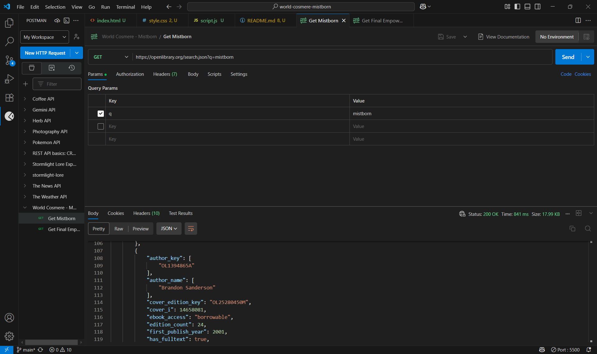
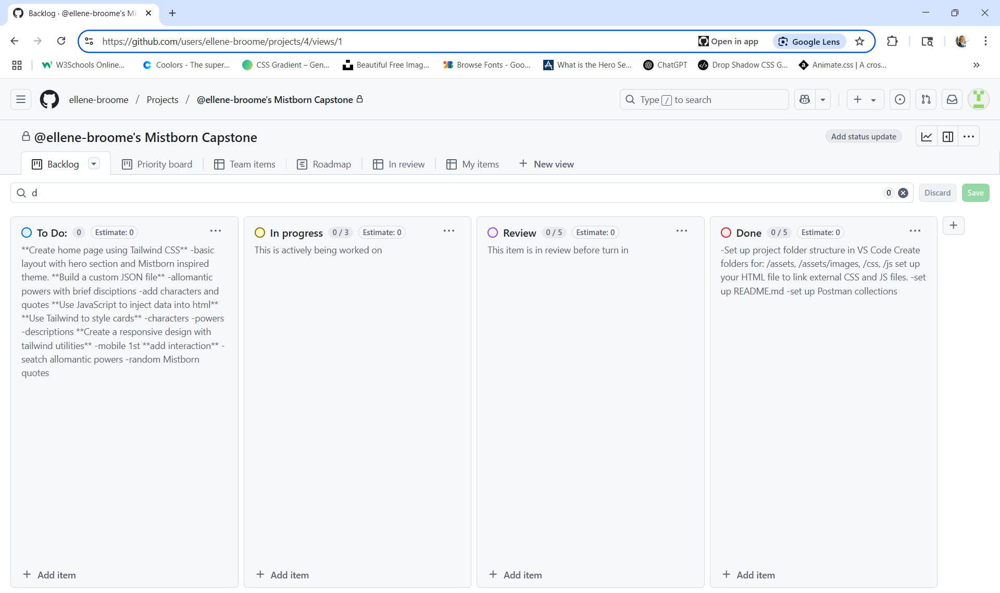

## Guide to understand placement and relativity of files and postman in vs.code`

mistborn-capstone/
├── index.html
├── style.css
├── script.js
├── README.md
└── assets/
    └── Images-postman-img.png

# Mistborn Capstone Project

**API Used:** Open Library API  
**Base URL:** `https://openlibrary.org`

## 🔮 Project Theme
A Mistborn-themed single-page app featuring:
- Character & book data
- Allomantic powers
- Quotes & visuals

Built using vanilla JavaScript, JSON data handling, and Tailwind CSS & vanilla css.

## 🧪 Postman Screenshot

## 🌐 Live Site
Will be deployed to GitHub Pages

## 📌 GitHub Project Board
